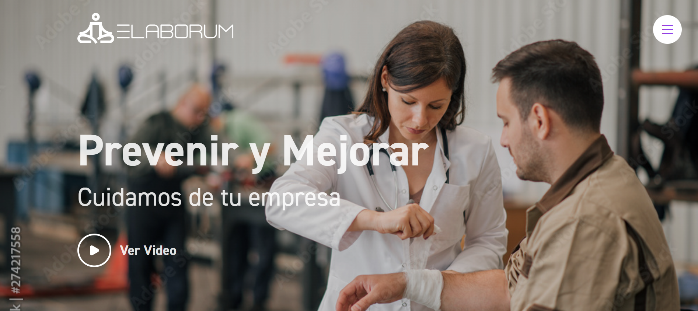

## Nobel Prize API
Real time integration with Nobel Prize API 
- 
- Tags: Nobel Prize API
- Badges:
  - React [blue]
  - Vite [blue]
- Buttons:
  - Try it [https://bright-stardust-02cb60.netlify.app/]

## Pine Website
Maintainance Website, fully responsive, MUI framework.
- 
- Tags: Pine Maintainance
- Badges:
  - Ressponsive [blue]
  - React [blue]
  - Vite [blue]
  - MUI[blue]
- Buttons:
  - Try it [https://example.com]

## Elaborum
Health and Security Website
- 
- Tags: Elaborum S.A
- Badges:
  - HTML [blue]
  - CSS [blue]
  - BEM [blue]
- Buttons:
  - Try it [https://nicorozo.github.io/elaborum/]

## Elite State
Generic but functional Real State project with React and Frameworks implementation
- 
- Tags: Elite State
- Badges:
  - Responsive [blue]
- Buttons:
  - Try it [https://nicorozo.github.io/elite_estate/]